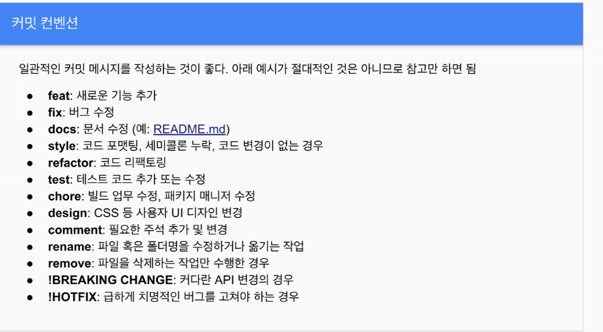

# 250311_11_이윤서

# git 명령어 정리

| 명령어 | 설명 |
| --- | --- |
| `git init`  | 파일들을 체계적으로 관리하겠다는 선언을 함(아예 새로 만들 때) 포크를 한 다음에 클론을 하면 굳이 안해도 됨(다른 저장소에서 시작했기 때문에) |
| `git status` | 파일에 수정 및 변경이 일어나면 해당 파일의 상태를 보여주는 명령어 |
| `git add`  | 기록할 파일은 추적이 되도록 인덱스에 등록을 시키는 명령어 (인덱스에 등록되지 않은 파일을 커밋이 되지 않음) 
 
`#특정한 파일들만 등록 
git add <파일명>`
 
`#특정한 형식의 파일을 모두 등록
git add *.txt`
 
`#수정된 모든 파일을 모두 등록
git add .` |

| `git commit` | 인덱스에 등록이 된 파일들을 remote 저장소에 올리기 전 준비를 시키는 명령어(여러 줄의 메세지를 포함 시키고 싶을때) |
| `git commit -m “메세지”` | 인덱스에 등록이 된 파일들을 remote 저장소에 올리기 전 준비를 시키는 명령어(한 줄의 메세지를 포함 시키고 싶을때) |
| `git push` | commit 완료된 파일들을 remote 저장소에 push 하는 명령어 |
| `git log` | commit 되어 push된 파일들의 히스토리를 파악할 수 있는 명령어 |
| `git branch` | 현재 존재하는 브랜치를 전부 조회하는 명령어 |
| `git checkout` | 다른 브랜치로 이동하는 명령어 |

# git commit 메세지 규칙 정리

- git commit을 실행할때 커밋 메세지를 작성할때 일정한 규칙을 정하고 그 규칙에 맞게 메세지를 작성하는 것이 좋다
- 왜 사용하는데?

  ⇒ 일관적인 커밋 메세지를 작성하는 것이 좋기 때문이다.

  ⇒ 일관적인 커밋 메세지를 작성하면, 다른 개발자나 직군과의 협업이 굉장히 쉬워지고 코드 가독성이 올라가 효율이 좋아 진다

  ⇒ 또한 다른 사람들도 코드의 수정사항이나 추가사항등을 쉽게 알 수 있어, 협업이 용이 해진다

# .gitignore

- 깃을 사용하기로 한 폴더(Local)에서 원격저장소(remote)에 올리지 않아도 되는 파일 목록을 작성한 파일
- 왜 쓰는데?
    - 개인적으로 써야하는 키 값이나, 토큰 값 같은것은 저장소에 올라가면 안되는 경우도 있기 때문에 따로 파일을 만들어 관리하는 편이 보안상 이롭기 때문이다.
    - 공개적으로 올려서는 안되는 코드나 회사의 기밀 사항 등과 관련된 코드들을 함부로 공개 할수 없기 때문에 따로 쉽게 관리 할 수 있기 때문이다.
    - 프로젝트 마다 실행시키는 환경이 다를 수 있기 때문에 충돌이 나서 에러를 방지 하기 위해 실행 파일은 저장소에 올리지 말고 각자의 컴퓨터에서 설치를 하고, 그 다음 코드만 내려 받는것이 충돌을 방지 할 수 있기 때문이다