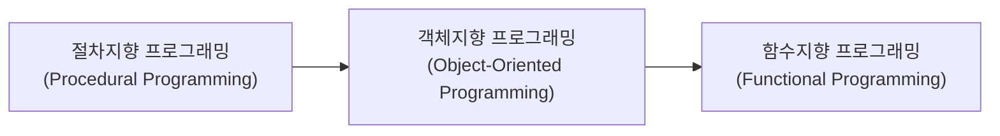

# FBC_Day04_객체지향 프로그래밍

# Homerome

1. 이윤서님 스터디 관심 있는 친구들 신청
2. 3월 28일 Meetup 이니 4시에 종료 예정임.
3. 디스코드 - 동글동글 - 블로깅
    1. 함께 블로그를 활성화 하기 위해 만든 모임. 오후 5시에 자세히 안내 예정
    2. 매주 목요일 Gather Town 에 모여서 발표

# 과제 체크 - Dart 프로그램 작성시 주의사항

## 공부방법

- 김옥현님 과제 참고하여 토픽별로 Dart 문서 독파 후 정리

## 문제1 풀이

- 입력 받은 수에서 3의 배수, 5의 배수 찾을 때 3부터 시작해도 됨

```dart
for (int i = 3; i < limit; i++) {
  if (i % 3 == 0 || i % 5 == 0) {
    sum = sum + i;
  }
}
```

## 문제2 풀이

- 함수 작성 주의사항
    - 리턴문은 하나만 있는 것이 정석 (리턴이 많으면 함수가 길어질 때 탈출 상황 파악 어려움)
    - 초반에 기본값 설정, 중간에 프로그램에 의해 변경, 마지막에 리턴하는 방식이 좋음
    - 맥락 파악하여 기본값 설정 후 변경시 셋팅되는 방식 사용
- 조건문 사용시에  `==`는 되도록 사용하지 않음
- 코딩 컨벤션 지킨다.
    - Reformat code 설정: `Ctrl+Alt+L`
- 알고리즘 연습 필요
    - 알고리즘 훈련 사이트 참고
    - 에라토스테네스의 체 참고 [https://namu.wiki/w/에라토스테네스의%20체](https://namu.wiki/w/%EC%97%90%EB%9D%BC%ED%86%A0%EC%8A%A4%ED%85%8C%EB%84%A4%EC%8A%A4%EC%9D%98%20%EC%B2%B4)

# 수업01_객체지향 프로그래밍: 인스턴스와 클래스

## 프로그래밍 패러다임의 변화



## 객체지향 개념

- 사물을 바라보고 객체를 도출
- 각 객체는 속성과 동작(기능)으로 정의
- 이를 가상세계에서 동작하도록 구현

## 객체 예시: 용사

- 속성: 이름, HP
- 기능: 싸우기, 도망, 앉기, 넘어지기, 잠자기

## 코드 컨벤션

### 클래스와 멤버변수 네이밍 컨벤션

- 클래스명: 명사, 단어의 맨 처음은 대문자(Pascal Case)
    - 예: Hero, MonsterInfo
- 필드명: 명사, 최초 이외의 단어의 맨 처음은 대문자(Camel Case)
    - 예: level, items, itemList
- 메소드명: 동사, 최초 이외의 단어의 맨 처음은 대문자(Camel Case)
    - 예: attack, findWeakPoint
- 객체 내 상수는 보통 코드 상단에 위치

## 함수와 메서드의 차이

- 함수: 단독적으로 동작하는 기능
- 메서드: 클래스의 기능으로 구현된 함수

## 클래스의 장점

- 클래스 정의를 통해 이용 가능한 타입의 종류가 점점 늘어남
- 절차지향 방식보다 코드 복잡성 감소
- 가독성 향상

## 참고 자료

- 수업 장표: [Google Slides](https://docs.google.com/presentation/d/1hetgQHHE8M0DkEnMlx_T7RAYHugfuT36ZASU9vNN7lU/edit?usp=sharing)

# 수업02_객체지향 개념 및 과제 가이드

## 객체지향 개념

- **객체**: 일반적인 현실세계에 있는 것들
- **클래스**: 컴퓨터에서 사용하기 위해 정의, 인스턴스 생성하기 위한 틀
- **인스턴스**: 메모리에 올라가서 사용준비가 된 아이들, 가상세계에서 활동

## 과제시 주의사항

- 연습문제를 풀때 단계별로 git commit 컨벤션 지키면서 진행
- 검색할 때 "dart random" 키워드 활용
- Alt + Enter로 import 자동 추가 가능

## 과제 완료 후 테스트 코드 작성

- 참고 장표: https://docs.google.com/presentation/d/1j4gzt57heEoR82P94zUiXN-Nd1Xt4S7LkymS86myfeo/edit?usp=sharing
- 테스트 코드는 test 폴더에 같은 경로로 만들고 파일명에 _test.dart 추가
    - copy path 기능 활용
- 테스트 기법
    - given(준비) > when(실행) > then(검증) 패턴 사용
    - 준비 단계에서 인스턴스 등장
    - 실행 버튼이 2개(메인과 test 앞에) - test는 여러개가 될 수 있기 때문
- 클래스 생성 및 메서드 추가시 항상 테스트 코드 작성
- dart는 다른 언어에 비해 생성자가 어렵다는 점 유의 (선생님 경험 측면)
- 생성자 예외 처리는 하지 않아도 된다. 다음에 배우고 나서 진행.
- https://pub.dev/packages/test

## 팀 작업 및 리뷰

- 테스트 코드를 기준으로 개발하는 방법이 테스트 주도 개발(TDD)
- 우리는 작성 후 테스트 방식으로 진행

## 프로그램 가독성 확보

[Rainbow Brackets Lite](https://plugins.jetbrains.com/plugin/20710-rainbow-brackets-lite--free-and-opensource)