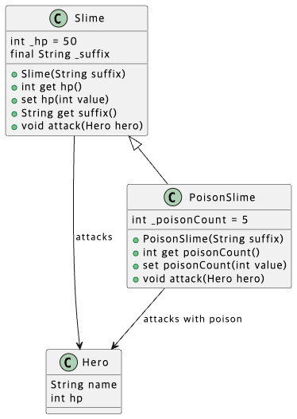
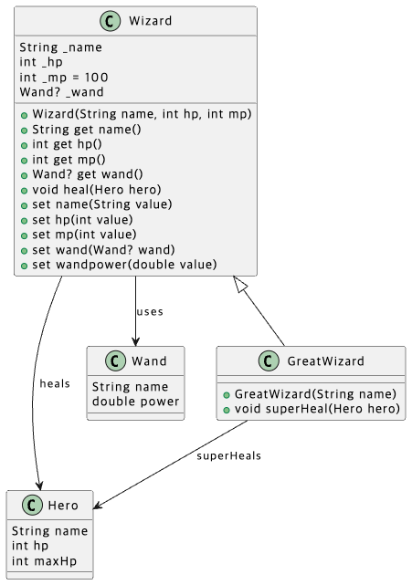

### 상속 (Inheritance)

> 이전에 만든 클래스와 닮았지만, 일부 다른 클래스를 만들어야 할 때 
복사 붙여넣기로 만드는 것이 아닌 상속을 이용하여 생성

```dart
class SuperHero extends Hero {
	SuperHero({required super.name, required super.hp});

bool _isFlying = false;

bool get isFlying => _isFlying;

set isFlying(bool value) {
	_isFlying = value;
    if (value) {
  	  print('$name이 날개를 펼쳤다.');
    } else {
  	  print('$name이 날개를 접었다.');
    }
  }
}
```

위 코드에서 볼 수 있는 ``super.name``은 this처럼 자기 자신을 지칭해주는 것이지만 super, 즉 자신이 상속하려는 (Hero 클래스)것을 불러와준다.

이를 통한 SuperHero 생성자 생성
``` dart 
// name과 hp는 Hero에서 상속받음
final hero = SuperHero(name: '홍길동', hp: 100);
hero.run();
```

### 오버라이드 (Override)

> 기존에 있는 메소드를 재정의

```dart
void main(List<String> arguments) {
  final hero = Hero(name: '홍길동', hp: 100);
  hero.run(); // 그 전의 run
  
  final superHero = SuperHero(name: '한석봉', hp: 50);
  superHero.run();  // Override된 run
}
```

### 올바른 상속, "Is-a 원칙"

> 올바른 상속이라면 is - a 원칙을 따른다.
개념적으로 is - a를 따르지 못한다면 모순이 생기게 됨

```dart
// 잘못된 상속 예시
class HealthPotion extends Weapon {
  // 생성자에서 부모 클래스 초기화
  HealthPotion() : super('체력 포션', 0);  
}

// 이러면 힐 포션으로 공격을 할 수 있게 되는 모순 발생
```

### 구체화와 일반화의 관계

> 부모 클래스 (Superclass)일 수록 추상적이고, 
자식 클래스 (Subclass)일 수록 구체적임

### 연습문제 


```
상속의 조건을 만족하려면 is-a 조건 충족해야 함

2. Engine은 Car이다. 이 말은 옳지 않기 때문에 상속에 어긋난다.
   Car은 Engine을 포함한다. 즉 Has-a관계가 성립한다.
3. Child는 Father이다. 이 말은 옳지 않기 때문에 상속에 어긋난다.
5. Man은 SuperMan이다. '슈퍼맨은 사람이다' 로 둘이 바뀌어야 한다.
```

--- 


```
(1) 안드로이드 Phone -> Phone -> 통신 기기
(2) 미니 쿠페 -> Car -> 이동수단
(3) 영어 사전 -> Dictionary -> 책
``` 

---


---

