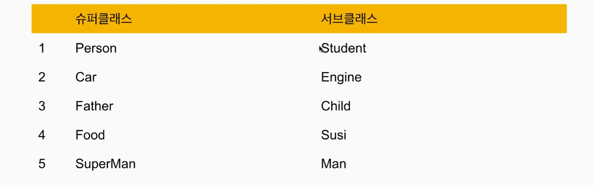

# 250318_11_이윤서

# 클래스 상속 (Class Inheritance)

- 객체지향 프로그래밍(OOP)의 중요한 개념으로, **기존 클래스를 확장하여 새로운 클래스를 만드는 기능**.
- 상속을 통해 기존 클래스의 속성(properties), 메서드(methods)를 재사용하면서, 새로운 기능을 추가하거나 기존 기능을 재정의(override)할 수 있음

## 1. 기본 상속 문법

- Dart에서 클래스를 상속을 하려면 `extends`키워드를 사용
    - `Child` 클래스가 `Parent` 클래스를 상속했기 때문에 `sayHello()` 메서드를 그대로 사용할 수 있음
        
        ```dart
        class Parent {
          void sayHello() {
            print("Hello from Parent!");
          }
        }
        
        class Child extends Parent {
          void sayHi() {
            print("Hi from Child!");
          }
        }
        
        void main() {
          var child = Child();
          child.sayHello(); // 부모 클래스의 메서드 사용 가능
          child.sayHi(); // 자식 클래스의 메서드
        }
        ```
        

## 2. 메서드 오버라이딩 (Method Overriding)

- **자식 클래스에서 부모클래스의 메서드를 재정의(override) 할 수도 있음**. 이때 `@override` 어노테이션을 붙여주면 된다.
    - `Child` 클래스에서 `showMessage()`를 다시 정의했기 때문에, 부모의 메서드가 아닌 자식의 메서드가 실행이 됨
        
        ```dart
        class Parent {
          void showMessage() {
            print("Message from Parent");
          }
        }
        
        class Child extends Parent {
          @override
          void showMessage() {
            print("Message from Child");
          }
        }
        
        void main() {
          var child = Child();
          child.showMessage(); // "Message from Child"
        }
        ```
        

## 3. `super` 키워드 사용

- **부모 클래스의 메서드를 자식 클래스에서 그대로 호출하고 싶을 때** `super` 키워드를 사용할 수 있다.
    - `super.showMessage();`를 호출해서 부모 클래스의 `showMessage()`를 실행한 후, 자식 클래스의 코드가 실행됨.
    
    ```dart
    class Parent {
      void showMessage() {
        print("Message from Parent");
      }
    }
    
    class Child extends Parent {
      @override
      void showMessage() {
        super.showMessage(); // 부모 클래스의 메서드 호출
        print("Message from Child");
      }
    }
    
    void main() {
      var child = Child();
      child.showMessage();
    }
    
    ```
    

## 4. 생성자 상속 및 `super` 키워드 사용

- 부모 클래스의 생성자를 호출하려면 `super` 키워드를 사용해야 한다.
    - `Child` 클래스에서 `super(name);`을 사용해서 부모 클래스의 생성자를 호출함
    
    ```dart
    class Parent {
      String name;
    
      Parent(this.name); // 생성자
    
      void display() {
        print("Parent Name: $name");
      }
    }
    
    class Child extends Parent {
      int age;
    
      // 부모 클래스의 생성자 호출
      Child(String name, this.age) : super(name);
    
      @override
      void display() {
        super.display();
        print("Child Age: $age");
      }
    }
    
    void main() {
      var child = Child("John", 10);
      child.display();
    }
    
    ```
    

## 5. 다중 상속은 지원되지 않음

- Dart는 **다중 상속(Multiple Inheritance) 을 지원하지 않음.**
- 즉, `extends` 키워드를 한 번만 사용할 수 있음
- 대신 Mixin을 이용해서 다중 기능을 추가할 수는 있음 ⇒ 나중에 따로 정리

# 올바른 상속

- 올바른 상속이란, 단순히 클래스를 확장하는 것 뿐만 아니라, 코드의 재사용성과 유지 보수성을 고려하면서 적절하게 상속을 활용하는 것을 의미한다.

## 올바른 상속을 위한 원칙

### 1. IS-A 관계를 만족해야 함.

- 상속을 사용할 때 **“자식 클래스가 부모 클래스의 한 종류인가?”** (IS-A 관계)를 따져야 한다.
- 예를 들어, `Dog extends Animal`은 적절하지만, `Car extends Animal`은 적절하지 않음.

### 2. 코드를 무조건 상속하지 말고, 상속이 적절한지 판단하기

- 단순히 코드 재사용을 위해 상속하는 것은 좋지 않음
- 상속은 강력한 개념이지만, 잘못 사용하면 코드가 불필요하게 복잡해지고, 유지보수가 어려워질 수 있다.
- 더 나은 방법(Composition 사용)
    - 이렇게 하면 `Car`와 `Engine`의 관계가 **HAS-A 관계(포함 관계)** 가 되고, 유지보수가 훨씬 쉬워짐
        
        ```dart
        class Engine {
          void start() {
            print("Engine started!");
          }
        }
        
        class Car {
          Engine engine = Engine();
        
          void startCar() {
            engine.start();
            print("Car is ready to go!");
          }
        }
        ```
        

### 3. 부모 클래스의 구현을 자식이 알아야 할 필요가 없어야 함 (캡슐화)

- 부모 클래스의 내부 구현이 변경되면, 자식 클래스에도 영향을 미칠 수 있음.
- 부모 클래스의 세부사항이 자식 클래스에 영향을 미치지 않도록 **캡슐화를 지켜야 한다**.
    - `helperMethod()`를 `_helperMethod()`로 변경해서 **private** 속성을 부여하면, 자식 클래스에서 재정의할 수 없게 되어 안전해짐.
    
    ```dart
    class Parent {
      void doSomething() {
        _helperMethod(); // 내부 메서드는 private으로 설정
      }
    
      void _helperMethod() {
        print("Helper method in Parent");
      }
    }
    
    class Child extends Parent {
      // _helperMethod()는 부모 클래스 내부에서만 사용되므로 재정의할 수 없음
    }
    
    ```
    

### 4. 오버라이딩을 할 때 부모의 의미를 유지해야 함.

- 자식 클래스에서 부모 클래스의 메서드를 오버라이딩 할 때는, **기존 기능을 완전히 변경하는 것이 아니라 확장하는 방식이 더 좋을때가 많음**.
- 특히 `super` 키워드를 적절히 활용해서 부모의 동작을 유지하는 것이 중요함.
    - `super.makeSound();`를 사용해서 부모의 원래 동작을 유지하면서, 새로운 동작을 추가함.
    
    ```dart
    class Animal {
      void makeSound() {
        print("Some animal sound");
      }
    }
    
    class Cat extends Animal {
      @override
      void makeSound() {
        super.makeSound(); // 부모의 기능 유지
        print("Meow!"); // 새로운 동작 추가
      }
    }
    
    ```
    

# 과제

1. 잘못 된 상속인 것을 모두 구하시오



⇒ 정답 : 2번, 5번

⇒ 사유

→ 2번 : Engine 은(는) Car 이다. 라는 문장은 IS-A 원칙에 맞지 않음

→ 5번 : SuperMan은 Man 이다. 라는 문장은 IS-A의 원칙에 맞지 않음