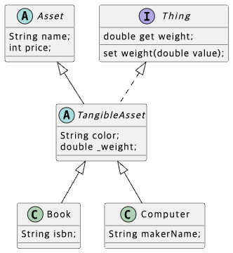

### 추상 클래스 (Abstract class)

> 상속의 재료로 사용되는 클래스
상세 부분이 일부 미정의 된 클래스

```dart
abstract class Character {
  string name;
  int hp;

  Character(this.name, this.hp);
  
  void run() {
    print('$name이 도망친다.');
  }
  
  // 추상 메소드
  void attack(Slime slime);
}
```

오버라이드를 강제하고 인스턴스화 금지

### 인터페이스 (Interface)

> 모든 메소드는 추상 메소드여야 하며, 필드를 가지지 않음

```dart
abstract interface class Attackable {
  void attack(slime target);  // 슬라임 공격
  void defend();
}

// 치유 가능한
abstract interface class Healable {
  void heal(Hero target);  // Hero만 치유 가능
}

```

### 인터페이스의 효과

1. 같은 인터페이스를 구현한 클래스들은 공통 메소드를 구현하고 있음을 보장
2. 어떤 클래스가 인터페이스를 구현하고 있다면, 적어도 그 인터페이스에 정의된 메소드를 가지고 있다는 것이 보증됨
3. 여러 인터페이스를 구현할 수 있음 (Hero에 attackable, Movable 구현)

```dart
// 인터페이스 구현 (implement)

class Hero implements Attackable {
  final String name;
  int hp = 100;
  
  Hero(this.name);
  
  @override
  void attack(Slime target) {
    print('$name의 물리 공격!');
    target.hp -= 10;
    print('$(target.name}에게 10의 데미지! (남은 HP: ${target.hp})');
}
```

### 추상과 인터페이스

| 특징  | 추상 클래스 (Abstract Class) | 인터페이스 (Interface) |
|-------|---------------------------|---------------------|
| 목적  | 공통 기능 제공 + 강제 구현 | 여러 역할을 조합 |
| 키워드 | `abstract class` | `abstract class` + `implements` |
| 필드  | 인스턴스 변수, 구현된 메서드 포함 가능 | 인스턴스 변수 포함 불가 |
| 메서드 | 구현된 메서드 포함 가능 | 모든 메서드는 반드시 구현해야 함 |
| 다중 구현 | 불가능 (단일 상속만 가능) | 가능 (`implements` 사용) |
| 객체 생성 | 불가능 | 불가능 |

---


