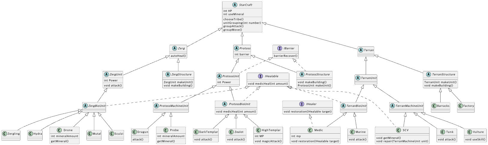

### 다형성 (Polymorphism)

> 어떤 것을 이렇게도 부를 수 있고, 저렇게도 부를 수 있는 것	

### 다형성의 활용

```dart
// 추상적인 선언 = 상세 정의로 인스턴스화

Character character = Hero('홍길동', 100);
```

### 타입 변경 방법 (Cast)

```dart
void main(List<String> arguments) {
  Monster monster = Slime('B');
  Slime slime = monster as Slime;
}
```

### 인스턴스의 타입 체크와 smart cast

```dart
void main(List<String> arguments) {
  Character character = Wizard('name', 10);
  if (character is Hero) {
    Hero hero = character;
  }
}
```

### 올바른 다형성 이용 / 코드의 중복 제거

```dart 
void main(List<String> arguments) {
  final characters = <Character>[]; // 빈 리스트 생성

  characters.add(Hero('슈퍼맨', 100));
  characters.add(Hero('배트맨', 200));
  characters.add(Wizard('해리포터', 50));
  characters.add(Wizard('헤르미온느', 50));

  // 모든 캐릭터의 hp 증가
  characters.forEach((character) {
    character.hp += 50;
  });
}
```

---

### 연습문제 1


```
(1) Sword 인스턴스, Sword를 생성했지만 어쨌든 item으로 보임
(2) Slime 인스턴스, Slime을 생성했지만 어쨌든 Monster로 보임
```
---
### 연습문제 2

```
1. abstract class X에서 a()만을 다루고 있기 때문에 X obj = A();는 override된 a()만을 호출할 수 있다.
2. abstract class Y implements X 는 X를 구현하고 있기 때문에 a()도 필수적으로 구현되어야 하며, Y y1 = A();과 Y y2 = B(); 로 인스턴스 생성 후 y1.a(), y2.a()를 실행하면 각각 a()인 Aa와 Ba가 차례대로 나온다.
```
---
