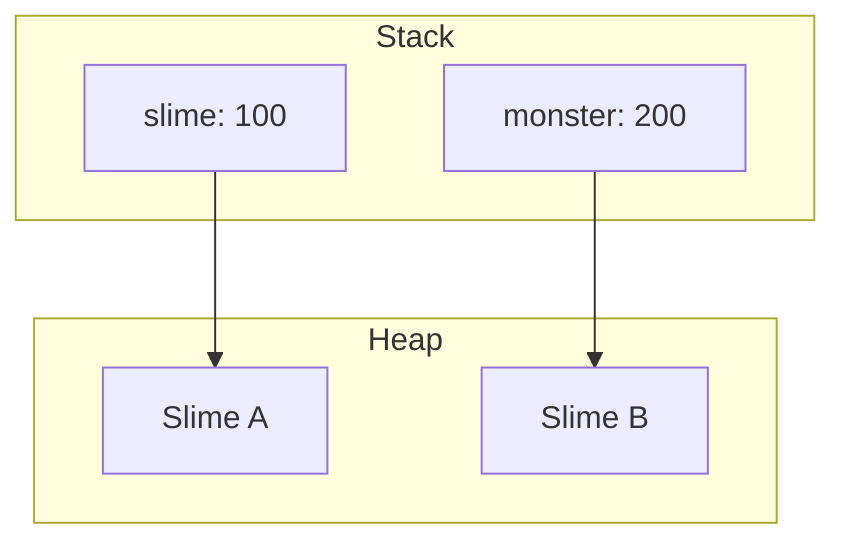

# 과제 리뷰 - Dart 프로그램 작성시 주의사항

## 학습 주의사항

- 팀이 함께 쉬어라.
- 복습은 키워드가 잘 녹아 있는 장표를 이용해서 한다.
- **키워드로 소통하는 습관.**

## 코드 리뷰

- 추상 클래스는 인스터스화가 되지 않으니 테스트 코드가 힘들다. 다만 상속 받은 하위 클래스를 테스트하면 함께 테스트 되는 개념이다.
- 추상 클래스로 만드는 기준 첫번째 인스턴스를 해야하나 말아야 하나가 먼저!
- 매직넘너 지양 : 반복 가능한 값은 매직넘버 보다는 의미있는 static 변수 선언해서 사용.
    - 다른 개발자가 볼 때 매직 넘버를 기준으로 상상할 수 밖에 없기 때문에 변수로 제공!
- 변수 선언 후 초기화 할 때 무의미한 숫자를 넣지 마라.

## 클래스 만드는 이유

- **남이 쓰기 좋게 만들어야 한다. 에러나지 않도록** (나를 위해 만드는 것이 아님을 기억)
- **생성자 만들기 힘들 때 다음을 이용 (플러그인 : Dart Data Class 를 설치 테스트)**

## AI 활용 - Good Idea!

- 배운데까지를 인공지능에게 알려주고 추천 문제를 받아 풀어보는 방식. Good

## 커밋 메세지 잘 쓰고 싶다면. AI 활용

- 커밋 메세지를 추천을 해준다. Tip 을 얻을 수 있다. .


이 버튼을 누르면 볼 수 있음.
왼쪽 상단에 있음.


- VS 편집기에도 있음.

## 자신의 코드 리뷰

- 다양한 참고를 통해 코드를 작성하다 보면, 동작은 잘 하더라도 코드 내용을 잊어버릴 수 도 있다.
- 그래서 반드시 코드를 보고 또 보고~ 복습해야 한다!
- throwArgumentError : 함수나 메서드에 파라메타(변수)에  Argument(인수)가 잘못전달 되었을 때 함수, 메서드 내에서 유효성 검사후 잘못되면  throw  할 수 있다.

# 1_교시_다형성_polymorphism_객체지향의 끝판왕

참고자료 https://docs.google.com/presentation/d/1_5apCHZCaVjVKMRpij8gM39ygoBSc2vn5Ze4tDNMrCQ/edit?usp=sharing

## 객체지향의 특징 4가지.

- 캡슐화(Encapsulation)
- 상속(Inheritance)
- 추상화(Abstraction)
- 다형성 (Polymorphism)

## 다형성

- **개발을 즐겁게 하는 다형성**
    - 어떤 것을 이렇게 부를 수 있고, 저렇게도 부를 수 있는 것.

- **공통 메소드를 통합한다.**
    - 각 객체들이 가지고 있는 공통 메소드를 통합
        - house.draw(), dog.draw(), car.draw()

- **공통기능을 묶는 용도로 쓰기위해  interface**
    - **설계관점에서 룰이 잡히게 된다.**
- **interface 정의**

```dart
abstract interface class Drawable {
	void draw();
}
```

- **interface 구현**

```dart
class House implements Drawable {
	@override 
	void draw() {
		print('집을 그린다'); 
	}
}
```

- **Class를 nterface로 선언**

```dart
//단일 Drawable 요소 생성
final Drawable element = House (
	address: '서울시 강남구', 
	size: 100, 
	color: Color.white
);

//Drawable 목록 생성
final List<Drawable> elements - <Drawable> [
	Dog(name, '멍멍이', age:3), 
	House(address: '서울시 강남구'),
	Tree(height:  5.0)
];
```

- **Drawable = Rectangle**

```dart
final Drawable drawable= Rectangle(
	width: 100, 
	height: 50, color: 
	Color.blue, 
	borderStyle: BorderStyle.dashed
);
```

```dart
void main() {
	final List<Thing> things = [
		Book(name: 'name', price: 1000, color: 'color', isbn: 'isbn', weight: 0),
		Computer(name: 'name', price: 1000, color: 'color', makerName: 'makerName', weight: 0);	
	];
}
```

- **Polymorphism 다형성**

```dart
final Drawable d = elements[i];  //실제 타입은 런타임에 결정됨
d.draw(); //실제 구현체의 draw() 메서드가 호출됨.
```

- **switch 문으로 타입 체크 가능**
    - 패턴 매칭을 통해서 각 타입을 파악할 수 있다.

```dart
final Drawable drawable = elements[i];

switch (drawable) {
	case Rectangle();
		print ('사각형이 선택됨');
		break; 
	case Rectangle();
		print ('집이 선택됨');
		break; 
	case Rectangle();
		print ('강아지가 선택됨');
		break; 
}
drawable.draw(); // 다형성: 실제 타입의 draw() 메서드 호출
```

- **다형성을 활용하는 방법**
    - 선언을 상위 개념으로 인스턴스 생성은 하위 개념으로 한다.

      **추상적인 선언 = 상세 정의로 인스턴스화**

      추상적으로 선언하고 상세적으로 인스턴스화 할 수 있다.

        ```dart
        Character character = Hero('홍길동' , 100);
        ```


- 두 번째 interface

```dart
abstract **interface** class Moveable {
	void move(int second);
}

classs Car implements Drawable, Moveable {
	final String brand; 
	final color color;
	final int speed;

	Car(this.brand, this.color, {this.speed = 100}); 	
	
	@override
	void draw() {
		print('자동차를 그립니다.');
	}
	
	@overrid 
	void move (int seconds) {
		final distance = speed * seconds;
		print ('$brand 자동차가 ${distance}m 이동했습니다.');
	}
}
```

- **클래스는 하나만 상속가능, 인터페이스는 여러개를 상속가능.**
    - 추상 클래스 내에도 추상 메서드만 정의가 가능한데 강제성을 위해서 인터페이스를 만든건가요?
- **다형성 실패 사례 (Hero 객체와 Sword 객체가 전혀 상속관계에서 연관성이 없음)**

    ```dart
    Character character = Hero('홍길동', 100); //OK
    Sword sword = Hero('name', 100);  //NG 
    ```

- **인터페이스를 변수의 타입으로 사용하기**

```dart
abstract ingerface class Human {
	void speak();
}

Human human = Dancer('name', 100);
```

**항상 is-a 원칙 중요**

- attack 과 fireball을 사용하는 마법사

```dart
class Wizard extends Character {
    Wand? wand;
    int mp = 100;

    Wizard(String name, int hp) : super(name, hp);

    @override
    void attack(Slime slime) {
        print('$name이 $slime을 공격했다.');
        slime.hp -= 20;
    }

    void fireball(Slime slime) {
        print('$name이 파이어볼을 썼다.');
        slime.hp -= 50;
        mp -= 20;
    }
}

```

```dart
void main(List<String> arguments) {
    Wizard wizard = Wizard('마법사', 50);
    Slime slime = Slime('A');

    wizard.attack(slime);      //호출가능
    wizard.fireball(slime);    //호출가능
}
```

attack(slime) 호출 가능한 이유는 Character 객체의 attak를 오버로딩 했기에. 가능

fireball(slime) 호출 분가능한 이유는 Character 입장에서 fireball(slime)는 보이지 않음.

```dart
void main(List<String> arguments) {
    Wizard wizard = Wizard('마법사', 50);
    Character character = wizard;
    Slime slime = Slime('A');

    character.attack(slime);
    character.fireball(slime); // 오류 발생 가능성 있음
}
```

출력 2.2;  슬라임을 슬라임이라 불러도 되고, 슬라임을 몬스터라고 불러도 된다.

- **결국은 제약을 줘서 실수를 줄인다.**
    - 결과는 오버라이드 된 run()이 두번 호출 된다. 2, 2

```dart
abstract class Monster {
    void run() {
        print('또벗또벗');
    }
}

class Slime extends Monster {
    int hp = 50;
    final String suffix;

    Slime(this.suffix);

    @override
    void run() {
        print('슬라임$suffix이/가 뚜벗뚜벗.');
    }
}

void main(List<String> arguments) {
    Slime slime = Slime('A');
    Monster monster = Slime('B');

    slime.run();
    monster.run();
}
```




- **타입 변경 방법**

```dart
void main(List<String> arguments) {
    Monster monster = Slime('B');
    Slime slime = monster as Slime;
}
```

- **캐스트 실패**

```dart
void main(List<String> arguments) {
    Character character = Wizard('name', 10);
    Hero hero = character as Hero;
}

// Unhandled exception:
// type 'Wizard' is not a subtype of type 'Hero' in type cast
```

- **인스턴스의 타입 체크와 smart cast**
    - 인스턴스 타입을 체크하면 smart cast가 되는데, 코드의 가독성을 높이는 장점이 있다.
    - 조건 통과하면 캐스팅을 한것으로 본다.
    - **(스마트 캐스트는 로컬변수와 파라미터에서만 작동하는데,  is 키워드와 ! = null 체크만으로도 스마트 캐스트가 적용된다. 이유는 필드는 다른 함수나 스레드에 의해 변경될 가능성이 높기 때문이다.**

  **활용사례: 스마트 캐스트는 코드의 간결성과 가독성을 높이는 데 유용합니다. 예를 들어, 상태 관리 패턴에서 특정 상태를 활인할 때 사용된다.**


```dart
void main(List<String> arguments) {
    Character character = Wizard('name', 10);
    if (character is Hero) {
        Hero hero = character;
    }
}
```

- Dart는 메소드 오버로딩을 지원하지 않는다.

```dart
class Hero extends Character {
    Hero(super.name, super.hp);

    @override
    void attack(Slime slime) {
        print('$name이 $slime을 공격했다.');
        print('10의 데미지');
        slime.hp -= 10;
    }

    void attack(Goblin slime) {
        // 메서드 오버로딩은 지원되지 않음
    }
}
```

- 다형성을 활용한 Hero
    - 구체화된 객체 대신 추상 클래스나 인터페이스를 인자를 받는다

```dart
class Hero extends Character {
    Hero(super.name, super.hp);

    @override
    void attack(Monster monster) {
        print('$name이 $monster을 공격했다.');
        print('10의 데미지');
        monster.hp -= 10;
    }
}
```

- 타입을 하나로 묶고, 잘 동작하게 하기

```dart
void main(List<String> arguments) {
    final monsters = <Monster>[]; // 빈 리스트 생성
    monsters.add(Slime('A'));     // run() 재정의
    monsters.add(Goblin());       // run() 재정의

    // 동작은 안에 담긴 객체를 따름
    monsters.forEach((monster) {
        monster.run();
    });
}
```

- 다형성의 메리트를 활용 못 한 코드

```dart
void main(List<String> arguments) {
    final h1 = Hero('슈퍼맨', 100);
    final h2 = Hero('배트맨', 200);
    final h3 = Wizard('해리포터', 50);
    final h4 = Wizard('헤르미온느', 50);

    // 묵혀겠씨
    // 여관에 머물기
    h1.hp = h1.hp + 50;
    h2.hp = h2.hp + 50;
    h3.hp = h3.hp + 50;
    h4.hp = h4.hp + 50;
}
```

- 코드의 중복 제거 (다형성의 메리트 : 동일한 타입으로 취급

```dart
void main(List<String> arguments) {
    final characters = <Character>[]; // 빈 리스트 생성
    characters.add(Hero('슈퍼맨', 100));
    characters.add(Hero('배트맨', 200));
    characters.add(Wizard('해리포터', 50));
    characters.add(Wizard('헤르미온느', 50));

    // 묵혀겠씨
    // 여관에 머물기
    characters.forEach((character) {
        character.hp += 50;
    });
}
```

- 타입을 하나로 묶고, 잘 동작하게 하기

```dart
void main(List<String> arguments) {
    final monsters = <Monster>[]; // 빈 리스트 생성
    monsters.add(Slime('A'));     // run() 재정의
    monsters.add(Goblin());       // run() 재정의

    // 동작은 안에 담긴 객체를 따름
    monsters.forEach((monster) {
        monster.run();
    });
}
```

- **인스턴스를 매매하게 통치기**
    - 상속에 의한 is-a 관계가 성립한다면, 인스턴스를 부모 클래스 타입의 변수에 대입할 수 있다.
    - 부모 클래스 타입 변수에 대입하는 것으로, 통 칠 수 있음.
- **상자의 타입과 내용의 타입의 역할**
    - 어떤 멤버를 이용할 수 있는가는 상자의 타입이 결정한다.
    - 멤버가 어떻게 움직이는지는 내용의 타입이 결정한다.
- **취급 변경**
    - **`as`** 키워드를 사용하여 타입 캐스팅을 수행한다.
    - **`is`** 키워드를 사용하여 타입을 검사할 수 있다.
- **다형성**
    - 같은 부모를 가지는 다른 인스턴스를 동일시하여, 부모 클래스 타입의 배열에 담을 수 있다.
    - 메서드가지고, 부모 클래스 타입의 인스턴타 값만 이용하며, 다른 클래스를 모아서 처리 가능.
    - 동일 취급을 해도, 각각의 인스턴스는 각 클래스의 정의를 따르고 다른 동작을 한다.

연습문제 1 풀이


(1) 이미지: **Sword 인스턴스**

     해설문: **Sword를 생성했지만 어쨌든 item으로 보임**

(2) 코드:  **Monster monster = Slime();**

이미지 : **Slim 인스턴스**

해설문 : **Slime을 생성했지만 어쨌든 Monster로 보임**

연습문제 2 풀이


1. X obj = A(); 생성한 경우 호출 할 수 있는 메소드는 a() 이다.
    1. X 입장에서 보이는 것은 자신내에서 정의된 a() 뿐이기 때문이다.