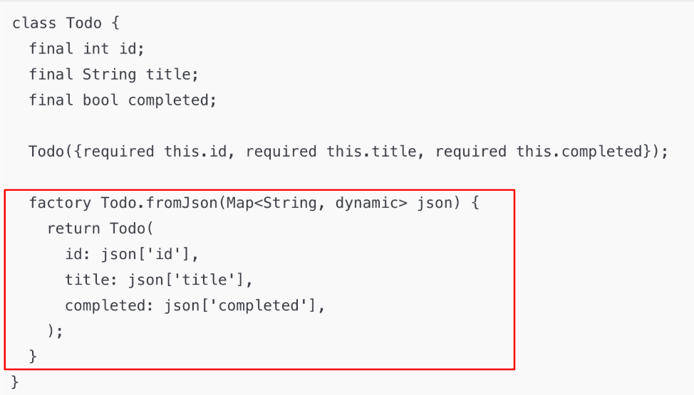

# 2025-03-31

# DataSource의 개념

## DataSource란?

- 앱이 사용하는 원천 데이터를 가져오는 통로
    - 마치 요리를 할 때 재료를 준비하는 과정
    - 다양한 형태 : 파일, 텍스트, JSON, DB 등
- 앱은 단독으로 데이터를 만들어내지 않는다.
- 대부분의 앱은 외부에서 데이터를 받아와서 화면에 보여준다.

## 역할

- 외부 데이터 저장소와 통신
- Raw 데이터 수신 및 처리
- CRUD 작업 수행

⇒ 즉, 데이터를 “가져오고", “정리해서", “보여주기 좋게 만드는" 역할

## JSON을 객체로 변환하는 코드

## factory.fromJson 알아보기

블럭이 있는 생성자 ⇒ 블럭을 만들어서 리턴을 하는 구조

이름이 있는 생성자를 써도 블럭을 쓸 수 있음 → 그렇다고 이름이 없는 생성자 에서 쓸 수 없는 건 아님

장점  

- 중간에 온갖 로직을 넣을 수 있다.(데이터 가공을 할 수 있음)
- 하지만 코드는 더욱 간결하게 할 수 있음
- 일반 메서드 처럼 쓸수 있음

## DataSource 에 따라 이름 짓기

## Impl 접미사를 사용하는 이름 관례

## 추천 디렉토리 구조

- Model → 내가 만든 클래스(fromJson 포함)