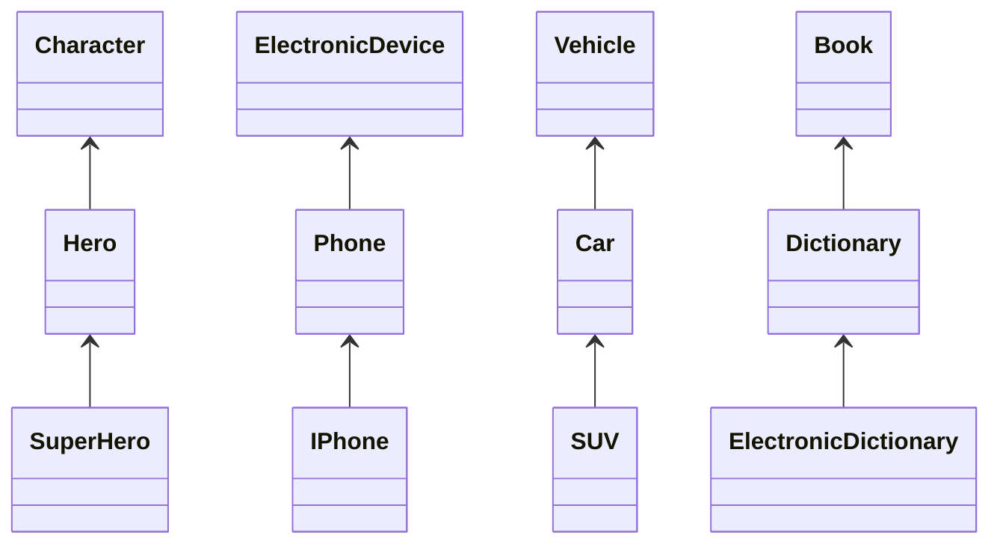

## 다음 중 `잘못 된 상속`인 것을 모두 구하시오.

| Super    | Sub     |
| -------- | ------- |
| Person   | Student |
| Car      | Engine  |
| Father   | Child   |
| Food     | Sushi   |
| SuperMan | Man     |

- Car, Engine
- SuperMan, Man

## 다음 클래스에 대해 `부모 클래스`와 `자식 클래스`를 1개씩 생각 해 보시오.

## 사전 정의된 Slime 클래스를 이용해 다음 사양을 따르는 PoisonSlime 클래스를 작성하시오.

1. 독 슬라임은 슬라임 중에서도 특히 독 공격이 되는 것
2. 독 슬라임은 다음의 코드로 인스턴스화 되는 클래스

   - `PoisonSlime poisonSlime = PoisonSlime('A');

3. 독 공격 가능 횟수를 저장하는 poisonCount(초기값 5)를 가져야 함
4. attack() 메소드가 호출되면 다음 내용의 공격을 가한다.

   - 보통 슬라임과 같은 공격
   - poisonCount가 0이 아니면 "추가로, 독 포자를 살포했다!"를 출력
   - 용사의 HP의 5분의 1에 해당하는 포인트를 용사의 HP로부터 감소시키고 "~포인트의 데미지" 출력
   - poisonCount를 1 감소

## Wizard 클래스 수정

- 속성
  - int mp (초기값 100)
- 메서드
  - heal(hero: Hero) 용사의 HP를 20 회복시키고 자신의 MP를 10 소모
  - mp가 부족하면 "마나가 부족합니다." 출력
  - 힐을 성공하면 "힐을 시전했습니다. 대상 HP: ${hero.hp}" 출력

## GreatWizard 작성

- Wizard 클래스를 상속
- 속성
  - mp가 150으로 증가
- 메서드
  - superHeal(hero: Hero) 용사의 hp를 전부 회복시키고 자신의 MP를 50 소모
  - mp가 부족하면 "마나가 부족합니다." 출력
  - 힐을 성공하면 "슈퍼 힐을 시전했습니다. 대상 HP: ${hero.hp}" 출력
