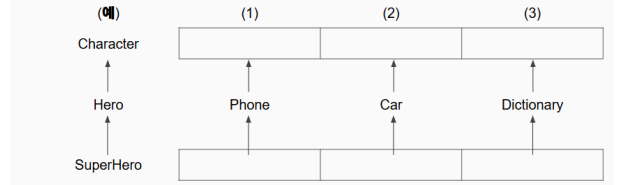

# 연습문제
---
## 연습문제 1
다음 중에서 “잘못 된 상속"인 것을 모두 구하시오

| 번호 | 슈퍼클래스   | 서브클래스 |
|------|--------------|-----------|
| 1    | Person       | Student   |
| 2    | Car          | Engine    |
| 3    | Father       | Child     |
| 4    | Food         | Susi      |
| 5    | SuperMan     | Man       |
---
- 2번  : Car와 엔진은 구성(Has-A) 관계이므로 상속(Is-A)에 적합하지 않다.
    - 구성(Has-A) 관계 예시 : 자동차는 엔진을 소유하고 있음
    - 상속(Is-A) 관계 예시 : 트럭은 자동차이다.
    - 슈퍼클래스를 Car라고 한다면 서브클래스는 차량 종류로 하는 것이 올바르다.(승합차, 트럭 등등)
    - 엔진을 서브클래스라면 슈퍼클래스는 머신이나 자동차부품 등이 올바르다.
- 3번 : Father와 Child 또한 Has-A 관계이므로 상속(Is-A)관계에 적합하지 않다.
    - 구성(Has-A) 관계 예시 : 아버지는 자식이 있다. (잘못된 상속)
    - 상속(Is-A) 관계 예시 : 자식은 가족이다. (올바른 상속) ⇒ 슈퍼클래스는 패밀리, 서브클래스는 차일드

- 5번 : 슈퍼클래스인 SuperMan과 서브클래스인 Man의 관계가 반전되었다.
    - 인류(또는 남자)는 슈퍼맨이다. (X) ⇒ 현재
    - 슈퍼맨은 인류(또는 남자)이다. (O) ⇒ 슈퍼클래스 = man / 서브클래스 = superMan
---
## 연습문제 2
다음 클래스에 대해 “부모 클래스" 와 “자식 클래스"를 1개씩 생각해 보시오

---
(1) 일렉토닉 디바이스(전자기기) ← Phone ← 스마트폰
(2) 탈것(V**ehicle)** ← Car ← 트럭
(3) 책 ← 사전 ← 국어사전

---
## 연습문제 3
이 클래스를 이용해, 다음 사양을 따르는 PoisonSlime 클래스를 작성하시오
```dart
class Slime {
  int hp = 50;
  final String suffix;

  Slime(this.suffix);

  void attack(Hero hero) {
    print('슬라임$suffix이/가 공격했다');
    print('10의 데미지');
    hero.hp -= 10;
  }
}
```

1. 독 슬라임(PoisonSlime) 은, 슬라임 (Slime) 중에서도 특히 “독 공격" 이 되는 것
2. PoisonSlime 는 아래의 코드로 인스턴스화 되는 클래스임
3. PoisonSlime 독 공격 가능 횟수를 저장하는 poisonCount(초기값 5)를 가진다
4. PoisonSlime attack() 메소드가 호출되면 다음 내용의 공격을 한다
    - a. 우선, “보통 슬라임과 같은 공격"을 한다
    - b. poisonCount가 0이 아니면 다음을 추가로 수행한다
    - c. 화면에 “추가로, 독 포자를 살포했다!ˮ 를 표시
    - d. 용사의 HP 의 1/5에 해당하는 포인트를 용사의 HP 로부터 감소시키고, “~포인트의 데미지" 라고 표시
    - e. poisonCount 를 1 감소 시킨다

### :memo: __**요약**__
| 요구사항                    | 내용                                                             |
|----------------------------|------------------------------------------------------------------|
| **상속 관계**               | `PoisonSlime`은 `Slime`을 상속받아야 함                        |
| **속성**                    | `poisonCount`: 독 공격 가능 횟수 (초기값 5)                     |
| **메서드**                  | `attack()`                                                      |
| **`attack()` 메서드 동작**  | 1. 기본 공격 (슬라임 클래스의 `attack()` 호출)                  |
|                            | 2. `poisonCount`가 0이 아니면 추가로:                           |
|                            |    - "독 포자를 살포했다!" 출력                                  |
|                            |    - 용사의 HP에서 1/5만큼 감소시키고, "포인트의 데미지" 출력  |
|                            |    - `poisonCount`를 1 감소시킴                                  |

---


## 연습문제 4 - Wizard 수정
속성:
- `mp`: Int (초기값 100)

메서드:
- `heal(hero: Hero)`: Unit의 `hp`를 20 회복시키고 자신의 `mp`를 10 소모.
  - `mp`가 부족하면 "마나가 부족합니다" 출력.
  - 힐을 성공하면 "힐을 시전했습니다. 대상 HP: `${hero.hp}`" 출력.

### :memo: __**요약**__
| 요구사항                    | 내용                                                             |
|----------------------------|------------------------------------------------------------------|
| **속성**                    | `mp`: 마나 (초기값 100)                                           |
| **메서드**                  | `heal(hero: Hero)`                                               |
| **`heal()` 메서드 동작**    | 1. 용사의 HP를 20 회복                                           |
|                            | 2. 자신의 `mp`를 10 소모                                        |
|                            | 3. `mp`가 부족하면 "마나가 부족합니다" 출력                      |
|                            | 4. 힐을 성공하면 "힐을 시전했습니다. 대상 HP: `${hero.hp}`" 출력 |

---

## 연습문제 5 - GreatWizard 작성
`GreatWizard` 클래스 요구사항:
- `Wizard` 클래스를 상속받음

속성:
- `mp`가 150으로 증가.

메서드:
- `superHeal(hero: Hero)`: Unit의 `hp`를 전부 회복시키고 자신의 `mp`를 50 소모.
  - `mp`가 부족하면 "마나가 부족합니다" 출력.
  - 힐을 성공하면 "슈퍼 힐을 시전했습니다. 대상 HP: `${hero.hp}`" 출력.

### :memo: __**요약**__
| 요구사항                    | 내용                                                             |
|----------------------------|------------------------------------------------------------------|
| **상속 관계**               | `GreatWizard`는 `Wizard` 클래스를 상속받아야 함                |
| **속성**                    | `mp`: 150 (기본 `mp`값 100에서 증가)                            |
| **메서드**                  | `superHeal(hero: Hero)`                                          |
| **`superHeal()` 메서드 동작**| 1. 용사의 HP를 전부 회복                                        |
|                            | 2. 자신의 `mp`를 50 소모                                        |
|                            | 3. `mp`가 부족하면 "마나가 부족합니다" 출력                      |
|                            | 4. 힐을 성공하면 "슈퍼 힐을 시전했습니다. 대상 HP: `${hero.hp}`" 출력 |