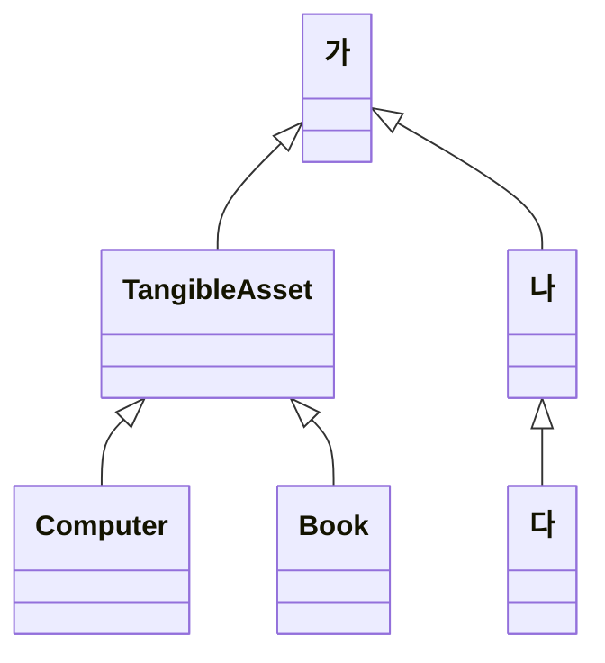

# 연습문제 1

어떤 회사에서 자산관리 프로그램을 만들려고 한다. 현시점에서 **컴퓨터**, **책** 을 표현하는, 다음과 같은 두개의 클래스가 있다

```dart
class Book {
  String name;
  int price;
  String color;
  String isbn;
  // ...
}

class Computer {
  String name;
  int price;
  String color;
  String makerName;
  // ...
}
```

이후, 컴퓨터와 책 이외에도 여러가지 자산을 관리하고 싶은 경우에 유용한 **유형자산(TangibleAsset)** 이라는 이름의 추상클래스를 작성 하시오. 또, Computer 나 Book 은 그 부모 클래스를 활용한 형태로 수정 하시오.

# 연습문제 2

문제 1 의 회사에서, 형태가 없는 무형자산(IntangibleAsset) 도 관리하려고 생각하고 있다.

무형자산에는, 예를들어 특허권(Patent) 등이 있다.

무형자산도 유형자산도 자산(Asset)의 일종이다.

이것을 전제로 다음의 상속도의 가, 나, 다 부분의 클래스명을 생각 해 보시오.



또한, (가) 에 들어가는 추상 클래스를 개발하고, 이 클래스를 상속하도록 TangibleAsset 를 수정하시오.

# 연습문제 3

자산인지 아닌지 따지지 말고, 형태가 있는 것 (Thing) 이면, **무게**가 있다

그래서, double 형으로 무게(weight)를 얻을 수 있도록 getter/setter를 가지는 인터페이스 Thing 을 만드시오

# 연습문제 4

유형자산 (TangibleAsset) 은, 자산 (Asset) 의 일종이며, 형태가 있는 것 (Thing) 의 일종이기도 하다.

이 정의에 맞도록 TangibleAsset 의 소스 코드를 수정하시오.

이 때, TangibleAsset 에 필드나 메소드의 추가가 필요하다면, 적당히 추가하시오.