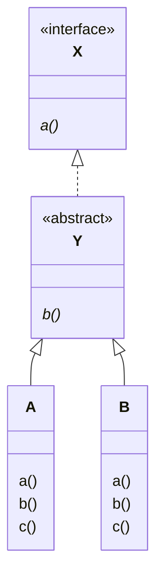
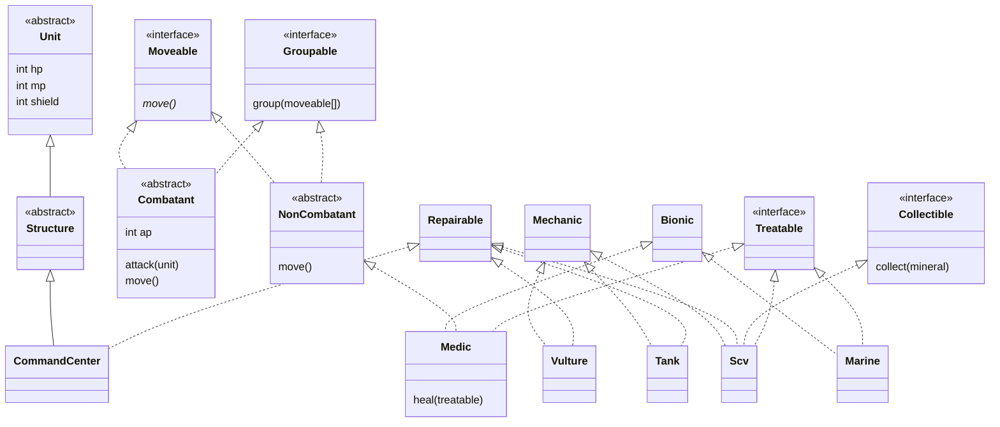
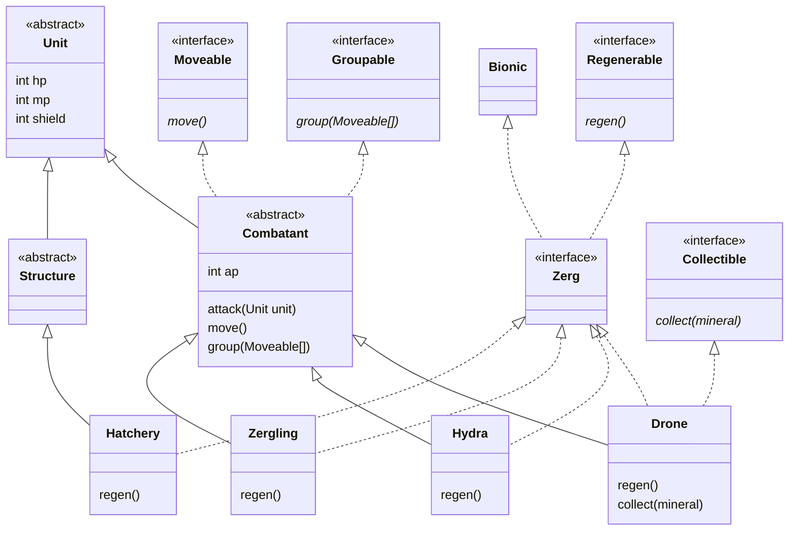
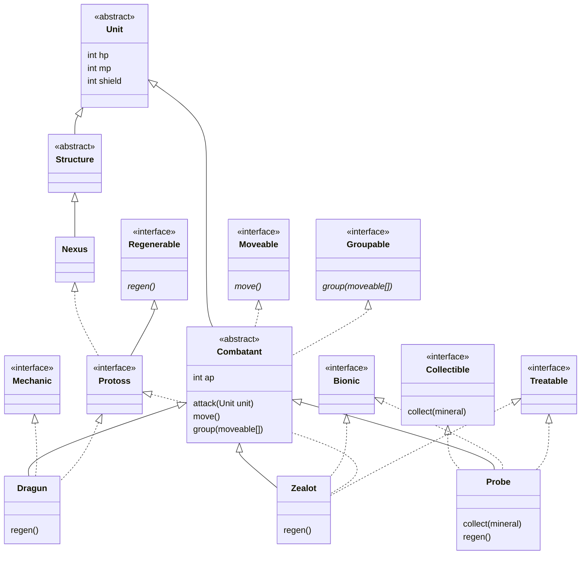

## 연습 문제 1

빈 칸에 들어갈 적절한 클래스명을 정하시오

| 번호   | 1                                        | 2                                       |
| ------ | ---------------------------------------- | --------------------------------------- |
| 코드   | Item item = Sword()                      | \_\_\_ monster = \_\_\_\_\_();          |
| 해설문 | \_\_\_를 생성했지만 어쨌든 \_\_\_로 보임 | Slime을 생성했지만 어쨌든 \_\_\_로 보임 |

1. Item Instance
2. Monster

## 연습 문제 2

다음과 같은 클래스가 선언되어 있다. 다음 물음에 답하시오.



### 1. `X obj = A();` 로 `A` 인스턴스를 생성한 후, 변수 `obj`에서 호출할 수 있는 메소드를 a(), b(), c() 중에 골라보시오.

= `a()`

### 2. 다음 코드를 읽고 `y1.a()`, `y2.a()`를 실행했을 때에 화면에 표시되는 내용을 말하시오.

```dart
Y y1 = A();
Y y2 = B();

y1.a();
y2.a();
```

- Aa
- Ba

## 연습 문제 3

문제 2에서 이용한 A 클래스나 B 클래스의 인스턴스를 각각 1개씩 생성하여, List에 차례로 담는다.
그 후에 List의 요소를 차례대로 꺼내 각각의 인스턴스의 b() 메서드를 호출 하여야 한다. 이상을 전제로 다음 물음에 답하시오.

1. List 변수의 타입으로는 `Y`를 사용해야한다.
2. 위에서 설명하고 있는 프로그램은 다음과 같다.

```dart
Y y1 = A();
Y y2 = B();
List<Y> list = [y1, y2];

for (final x in list) {
  x.b();
}
```

## 연습 문제 4

- 드디어 게임 만들 때가 왔다. 요구사항에 맞는 설계를 하시오 (코딩 금지)
- Terran, Zerg, Protoss 세 종족이 있습니다.
- 유저는 3가지 종족 중 하나를 선택하여 1:1로 대결하거나, 2:2로 팀플레이를 하는 등의 실시간 게임입니다. (LOL 같은)
- 유닛(Unit)과 건물(Structure)이 존재합니다.
- 유닛과 건물은 생물(Bionic) 또는 기계(Mechanic) 로 나뉩니다.
- Terran 은 인간 종족이고 생물(Bionic)인 Marine(해병), Medic(간호사) 과 기계 유닛(Mechanic)인 Tank(탱크), Vulture(오토바이), Scv(일꾼로봇) 가 있습니다.
- Scv는 일꾼 유닛으로 광맥 자원을 채취할 수 있으며, 기계 유닛의 수리를 할 수 있습니다.
- 광맥 자원은 유닛을 생산하는데 쓰입니다.
- 대부분의 유닛은 공격이 가능하지만 Medic은 다른 유닛과 다르게 공격은 할 수 없고 생물유닛을 치료할 수 있습니다.
- Scv는 기계 유닛이지만 예외로 Medic 의 치료대상이 될 수 있습니다.
- 위 정보를 토대로 Marine, Medic, Tank, Vulture, Scv 클래스를 설계하시오.

## 연습 문제 5

- Zerg 종족은 모든 유닛과 건물이 외계 생물(Bionic)체입니다.
- 생물 유닛 Zergling(저글링), Hydra(히드라) 등등 있음
- 에어리언 같은 미개한 종족이라고 생각하면 되고 건물도 모두 살아있는 생명체입니다.
- 모든 유닛과 건물은 피해를 입어도 시간이 지나면 서서히 회복됩니다.
- 저그의 건물은 생물이지만, 생물을 치료하는 테란의 Medic 의 치료 대상이 될 수는 없습니다.
- 위 조건에 맞도록 클래스 설계를 수정하시오

## 연습 문제 6

- Protoss 종족은 선진 문명을 가진 외계 종족으로 Zealot(외계인), Dragun(기계유닛) 등의 유닛으로 구성되어 있습니다.
- 프로토스 종족은 모든 유닛과 건물에 어느 정도의 방어막이 있습니다.
- 방어막은 가만히 있으면 서서히 회복합니다.
- Zealot은 생물 유닛이고 Dragun은 기계 유닛입니다.
- 프로토스의 모든 생물 유닛은 테란의 Medic 이 치료 가능합니다.

## 연습 문제 7

- 여러 유닛을 그룹화 가능합니다
- 유닛 그룹화를 통해 유저가 유닛 컨트롤을 용이하게 해야 합니다.

예를 들면 10개의 서로 다른 유닛을 그룹화하고 한번에 공격을 하거나 이동을 시켜야 합니다.
- 그룹화가 가능하도록 설계를 수정하시오.

### Terran



### Zerg



### Protoss



[Figjam - Starcraft Design](https://www.figma.com/board/2u2DerTBJGaQsXo21oNnJp/Starcraft-Design?node-id=0-1&p=f&t=Qs3of1hZG1KpZDOr-0)
